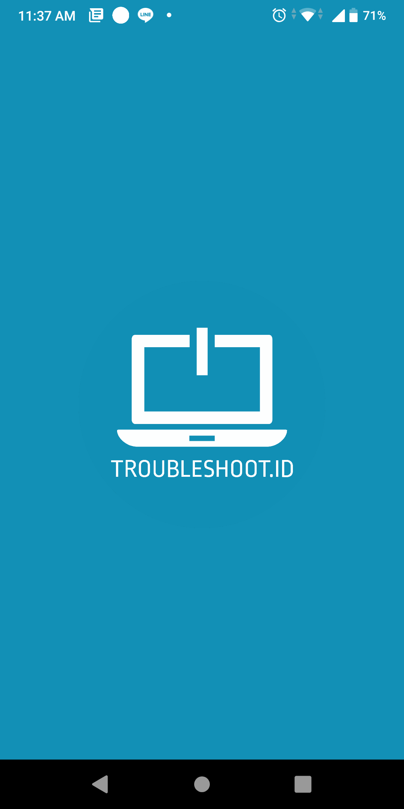
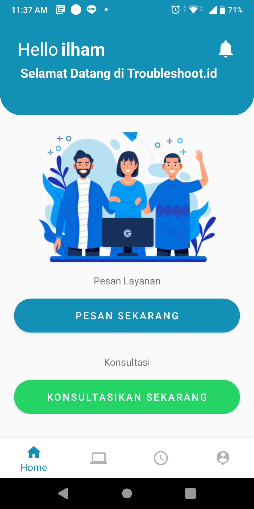
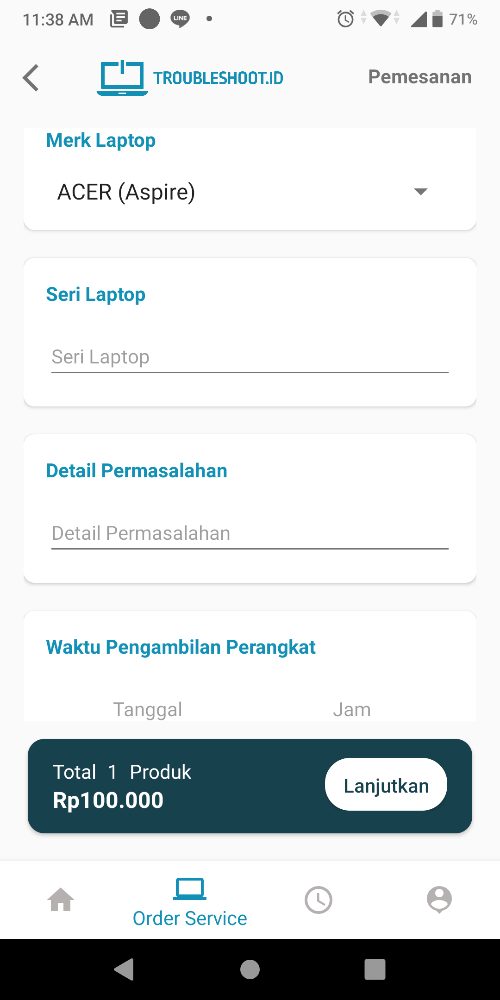
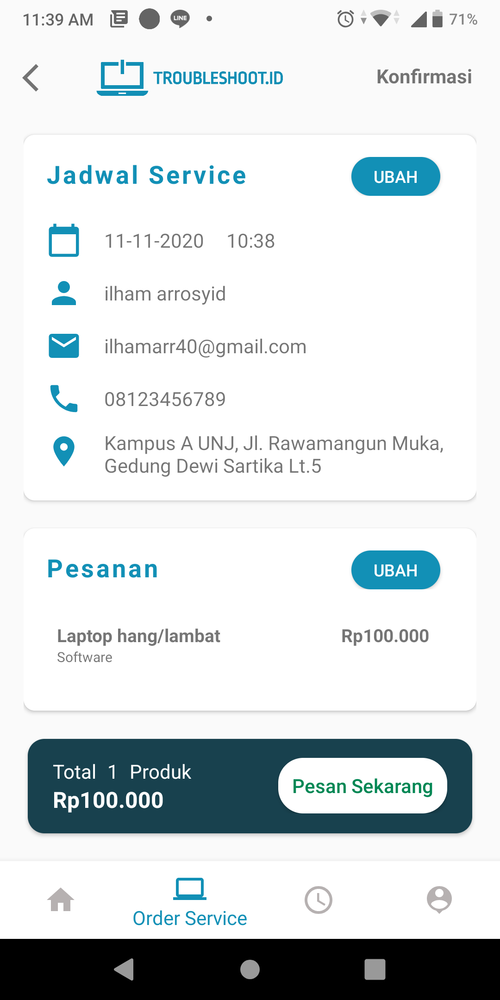
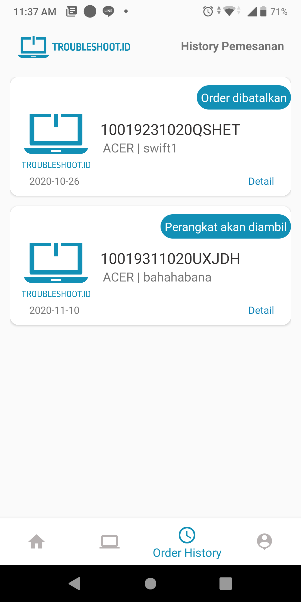
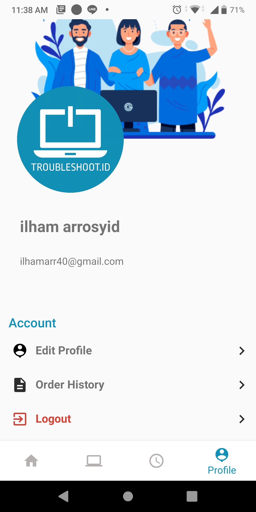

# Troubleshoot.id
Troubleshoot.id merupakan sebuah usaha yang bergerak dibidang jasa service center laptop dan komputer di DKI Jakarta. Troubleshoot.id hadir dari keresahan para pengguna laptop/Komputer dalam mencari tempat serive yang mudah dijangkau, pengerjaannya cepat dan sangat bisa diandalkan. Layanan Yang dimiliki Trouleshoot.id diataranya:
1. Perbaikan Hardware
2. Perbaikan Software
3. Konsultasi IT
 
Dalam perjalanannya, Troubleshoot.id menghadirkan sebuah sistem 'Troubleshoot Mobile Application' yang dapat mempermudah para pelanggan setianya untuk mendapat

## Developer Team
| No | NAMA           | NIM        | ROLE                |
|----|----------------|------------|---------------------|
| 1  | Vivi Rofiah    | 1313617001 | Front End Developer |
| 2  | Bagus Nugraha  | 1313617002 | Back End Developer  |
| 3  | Ilham Arrosyid | 1313617018 | Project Leader      |

## Gambaran dari Aplikasi
                

## Debug Aplication (For Tester):
[DOWNLOAD HERE](https://drive.google.com/uc?export=view&id=1UiFTygba1U2Nziy0sNb2QApkp33hgXe5)

 
 

