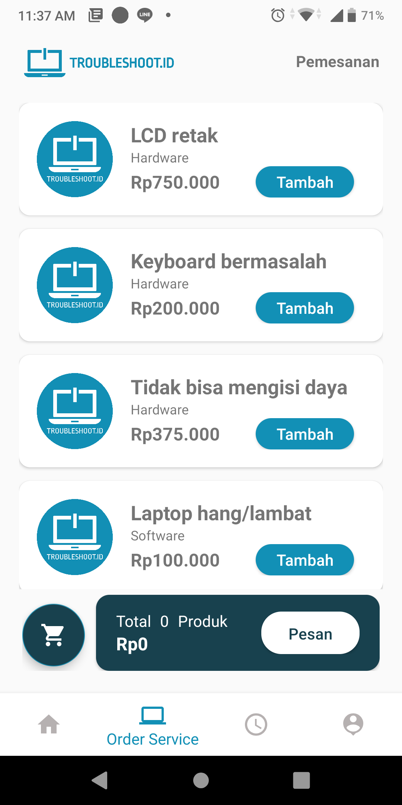

# Troubleshoot.id
Troubleshoot.id merupakan sebuah usaha yang bergerak dibidang jasa service center laptop dan komputer di DKI Jakarta. Troubleshoot.id hadir dari keresahan para pengguna laptop/Komputer dalam mencari tempat serive yang mudah dijangkau, pengerjaannya cepat dan sangat bisa diandalkan. Layanan Yang dimiliki Trouleshoot.id diataranya:
1. Perbaikan Hardware
2. Perbaikan Software
3. Konsultasi IT
 
Dalam perjalanannya, Troubleshoot.id menghadirkan sebuah sistem 'Troubleshoot Mobile Application' yang dapat mempermudah para pelanggan setianya untuk mendapat

## Tim Pengembang
| No | NAMA           | NIM        | ROLE                |
|----|----------------|------------|---------------------|
| 1  | Vivi Rofiah    | 1313617001 | Front End Developer |
| 2  | Bagus Nugraha  | 1313617002 | Back End Developer  |
| 3  | Ilham Arrosyid | 1313617018 | Project Leader      |

## Product Backlog
[LIHAT DISINI](https://docs.google.com/spreadsheets/d/1tAw_0VnchsDlhi_rwpmGFem3s4aY-afY/edit#gid=966213186)

## Final Report
[final report document](http://bit.ly/final_report_troubleshootid)

## Download Aplikasi:
[DOWNLOAD HERE](http://bit.ly/Troubleshoot_apps)

## Gambaran dari Aplikasi
                

## List Link Sprint:
[Sprint 1](https://github.com/Ilhamarr/TroubleshootAndroid/edit/master/) : Menentukan product backlog, tampilan, sprint dan use case

 
 

